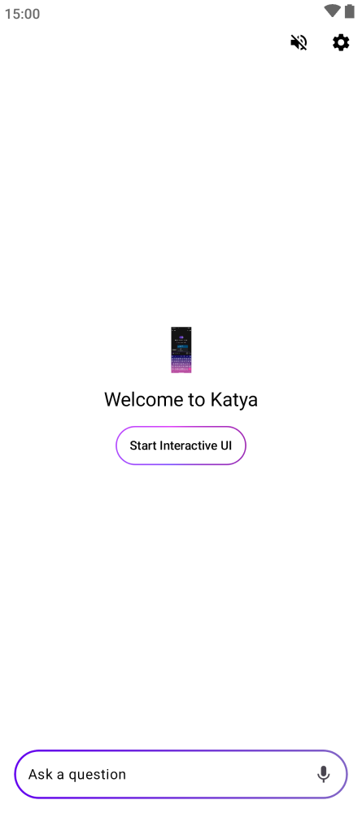
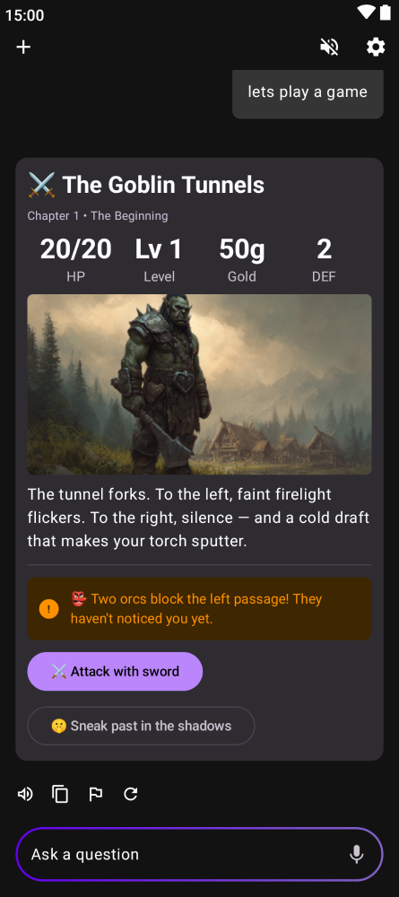
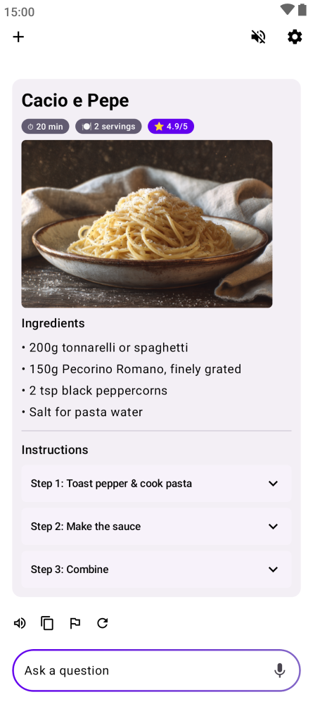
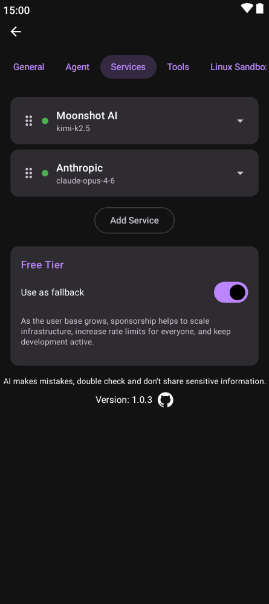

# Katya AI Assistant

   
<div align="center">

<br>

<br>
<br>

An **open-source AI assistant with persistent memory** that runs on **Android, iOS, Windows, Mac, Linux, and Web**.

</div>


## Features

### Release 1.0.8 Updates
- **Bug fixes**: Fixed Server Monitor UI errors, refactored ChatViewModel and AppSettings, and fixed test compilation errors.
- **Application Icon/Avatar**: Updated to a new image.
- **UI Markdown Formatting**: Improved markdown formatting prompt to prevent raw HTML tags.
- **Server Monitor Overlay**: Added a real-time monitor overlay displaying CPU/RAM/GPU usage from your SSH-connected Linux server.
- **Monitoring Modes**: Toggle between Off, Short, and Full diagnostics (runs `lspci`, `sensors`, `lsblk`, `df -h`) from Server Settings.
- **Improved UI Safety**: Fixed HTML tags being rendered raw in chat bubbles.
- **Dependency Refactoring**: Codebase refactored to cleanly pass `AppSettings` to ViewModels and UI.

### Release 1.0.7 Updates
- **Custom Logo**: Replaced the default logo animation with a custom Fixiki "Pomogator" shield.
- **In-App Logging System**: Added `AppLogger` to capture internal logs (such as SSH tunnel connection steps).
- **Log Viewer UI**: Users can now enable/disable logging in Server Settings and view, copy, and clear logs directly from the app interface.
- **UI Tweaks**: Ensured proper visibility of titles in Server Settings in dark mode and added a password visibility toggle.

### Release 1.0.5 Updates
- **Voice Selection**: Added a quick link to Android's System TTS settings to change voices directly from the app.
- **SSH Tunnel Fix**: The SSH tunnel now automatically reconnects reliably.
- **AI Task Execution**: The assistant now makes an attempt to execute tasks before deciding it cannot do them.
- **Microphone Privacy**: Fixed microphone permission usage so the microphone is completely inactive when Voice Activation is explicitly turned off.

### Wake Word (Voice Activation)

Katya supports offline voice wake word detection using [Vosk](https://alphacephei.com/vosk/) speech recognition.

- **Offline processing** — all speech recognition happens on-device, no internet required
- **Multi-language** — built-in Russian and English models, or choose any Vosk model from the portal
- **Customizable trigger** — change the wake word phrase (default: "привет катя")
- **Vibration & sound feedback** — configurable haptic and audio response on wake word detection
- **Auto-download** — models are downloaded and extracted in the background with progress notification
- **Portal integration** — browse and select any Vosk model from alphacephei.com; the app intercepts the download link automatically

Configure in **Settings > General > Wake Word**.

### System Permissions (Android)

On first launch, Katya sequentially requests:
- Root access (if available)
- Battery optimization exclusion (keeps background services alive)
- Unused app restrictions pause (prevents Android from killing the app)

## Installation

Homebrew (macOS):

```
brew install --cask simonschubert/tap/kai
```

AUR (Arch Linux):

```
yay -S kai-bin
```

Winget (Windows):

```
winget install SimonSchubert.Kai
```

### Direct Downloads

| Platform | Format | Download |
|----------|--------|----------|
| Android | APK | [GitHub Releases](https://github.com/SimonSchubert/Kai/releases) |
| macOS | DMG | [GitHub Releases](https://github.com/SimonSchubert/Kai/releases) |
| Windows | MSI | [GitHub Releases](https://github.com/SimonSchubert/Kai/releases) |
| Linux | DEB | [GitHub Releases](https://github.com/SimonSchubert/Kai/releases) |
| Linux | RPM | [GitHub Releases](https://github.com/SimonSchubert/Kai/releases) |
| Linux | AppImage | [GitHub Releases](https://github.com/SimonSchubert/Kai/releases) |

## AI That Builds Screens, Not Just Text

Kai 9000's Interactive UI lets the AI generate full interactive screens — quizzes, dashboards, recipes, brainstorms, and more. Navigate by tapping buttons instead of scrolling through chat.

   

## Features

- **Persistent memory** — Kai remembers important details across conversations and uses them automatically
- **Customizable soul** — Define the AI's personality and behavior with an editable system prompt
- **Multi-service fallback** — 24 LLM providers with automatic failover
- **On-device inference** — Run AI models locally on Android using LiteRT, no internet needed
- **Tool execution** — Web search, notifications, calendar events, shell commands, and more
- **MCP server support** — Connect to remote tool servers via the Model Context Protocol
- **Autonomous heartbeat** — Periodic self-checks that surface anything needing attention
- **Settings export/import** — Backup and restore all settings as a JSON file
- **Encrypted storage** — Conversations stored locally with encryption
- **Text to speech** — Listen to AI responses
- **Linux Sandbox** — On Android, the AI can run shell commands, scripts, and tools in a secure sandboxed Linux environment
- **Image attachments** — Attach images to any conversation

## Linux Sandbox (Android)

On Android, Kai includes a built-in Linux environment that the AI can use to execute shell commands, run scripts, and operate tools on your behalf. This turns Kai from a chat-only assistant into one that can take real action — installing packages, processing data, running Python scripts, and more.

- **Powered by Alpine Linux** — A lightweight ~3 MB download sets up a full Linux userland via [proot](https://proot-me.github.io/), no root required
- **Optional packages** — One tap installs bash, curl, wget, git, jq, python3, pip, and Node.js
- **Interactive terminal** — A built-in terminal lets you run commands manually alongside the AI
- **Secure** — Everything runs sandboxed inside the app with no access to the host system

Enable it in **Settings > Linux Sandbox**.


## Screenshots

### Desktop


### Web


### Mobile

     

## How It Works

```
                        ┌────────┐
                        │  User  │
                        └───┬────┘
                            │ message
                            ▼
               ┌─────────────────────────┐
               │          Chat           │
               │                         │
               │  prompt + memories      │
               │        │                │
               │        ▼                │
               │    ┌────────┐           │
               │    │   AI   │◀─┐        │
               │    └───┬────┘  │        │
               │        │   tool calls   │
               │        │   & results    │
               │        ▼      │        │
               │    ┌────────┐ │        │
               │    │ Tools  │─┘        │
               │    └───┬────┘          │
               │        │               │
               └────────┼───────────────┘
                        │ store / recall
                        ▼
               ┌─────────────────┐    hitCount >= 5
               │     Memory      │───────────────────┐
               │                 │                   │
               │  facts, prefs,  │                   ▼
               │  learnings      │          ┌────────────────┐
               │                 │◀─delete──│ Promote into   │
               └─────────────────┘          │ System Prompt  │
                        ▲                   └────────────────┘
                        │ reviews
                        │
               ┌─────────────────┐
               │    Heartbeat    │
               │                 │
               │  autonomous     │
               │  self-check     │
               │  every 30 min   │
               │  (8am–10pm)     │
               │                 │
               │  all good?      │
               │  → stays silent │
               │  needs action?  │
               │  → notifies user│
               └─────────────────┘
```

- **Chat** — User sends a message. The AI responds, calling tools (memory, web search, shell, etc.) in a loop until it has a final answer.
- **Memory** — The AI stores and recalls facts, preferences, and learnings. Memories that prove useful (5+ hits) can be promoted into the system prompt permanently.
- **Heartbeat** — A background self-check runs every 30 minutes. It reviews memories, pending tasks, and emails. If something needs attention, it notifies the user. Otherwise, it stays silent.

## Supported Services

**[Atlas Cloud](https://www.atlascloud.ai?utm_source=github&utm_medium=link&utm_campaign=Kai)** · [Anthropic](https://console.anthropic.com) · [OpenAI](https://openai.com) · [Gemini](https://aistudio.google.com) · [DeepSeek](https://www.deepseek.com) · [Mistral](https://mistral.ai) · [xAI](https://x.ai) · [OpenRouter](https://openrouter.ai) · [Groq](https://groq.com) · [NVIDIA](https://developer.nvidia.com) · [Cerebras](https://cerebras.ai) · [Ollama Cloud](https://ollama.com) · [LongCat](https://longcat.chat) · [Together AI](https://together.ai) · [Hugging Face](https://huggingface.co) · [Venice AI](https://venice.ai) · [Moonshot AI](https://moonshot.cn) · [Z.AI](https://z.ai) · [MiniMax](https://minimax.io) · [AIHubMix](https://aihubmix.com) · [Deep Infra](https://deepinfra.com) · [Fireworks AI](https://fireworks.ai) · [OpenCode](https://opencode.ai) · OpenAI-Compatible API · LiteRT On-Device (Android) · Free tier (no API key needed)

## MCP Servers

Kai supports the [Model Context Protocol](https://modelcontextprotocol.io/) for connecting to external tool servers. Go to **Settings > Tools > Add MCP Server** to connect to any Streamable HTTP MCP endpoint, or pick from a curated list of popular free servers:

| Server | Description |
|--------|-------------|
| Fetch | Fetch web content and convert HTML to markdown |
| DeepWiki | AI-powered docs for any GitHub repo |
| Sequential Thinking | Structured step-by-step problem-solving |
| Context7 | Up-to-date library and framework docs |
| Globalping | Ping, traceroute, DNS from global probes |
| CoinGecko | Real-time crypto prices and market data |
| Manifold Markets | Prediction market data and odds |
| Find-A-Domain | Domain availability across 1,444+ TLDs |

All popular servers are free and require no API key. MCP servers auto-reconnect on app startup.

## Integrations

### Splinterlands Auto-Battle (Android & Desktop)

Kai can automatically play [Splinterlands](https://splinterlands.com) Wild Ranked battles. Configure one or more LLM services in priority order, add your Hive account, and hit Start -- Kai will continuously find matches, pick teams using LLM-powered strategy, and submit them on-chain. Falls back to a simple greedy picker if all LLM services fail. Available in **Settings > Integrations**.

## Supported Languages

Afrikaans, Albanian, Amharic, Arabic, Belarusian, Bengali, Bulgarian, Chinese (Simplified), Chinese (Traditional), Croatian, Czech, Danish, Dutch, English, Estonian, Filipino, Finnish, French, German, Greek, Gujarati, Hebrew, Hindi, Hungarian, Indonesian, Italian, Japanese, Kazakh, Korean, Latvian, Lithuanian, Malay, Marathi, Norwegian, Persian, Polish, Portuguese, Punjabi, Romanian, Romansh, Russian, Serbian, Slovak, Slovenian, Spanish, Swahili, Swedish, Tamil, Telugu, Thai, Turkish, Ukrainian, Urdu, Vietnamese, Zulu

## Contributing

### Screenshot Automation

Two separate screenshot pipelines exist, both using Compose screenshot tests:

**README screenshots** — Used for this README. CI runs this automatically on every push and auto-commits any changes.

```bash
./gradlew :screenshotTests:updateScreenshots
```

**Store screenshots** — Generates localized screenshots for the Play Store in all supported locales. Upload via fastlane.

```bash
./gradlew :screenshotTests:generateStoreScreenshots
bundle exec fastlane android upload_screenshots
```

**Kai UI component screenshots** — Records golden images for `KaiUiScreenshotTest` only. Faster than recording the full suite when iterating on Kai UI components.

```bash
./gradlew :screenshotTests:recordKaiUiScreenshots
```

## Sponsors

This project is open-source and maintained by a single developer. If you find this app useful, please consider sponsoring to help take it to the next level with more features and faster updates.

## Credits

- Based on [Kai 9000](https://github.com/SimonSchubert/Kai) by Simon Schubert
- Vosk speech recognition: https://alphacephei.com/vosk/
- Mistral: https://mistral.ai/

## Release Notes

### v1.x (Latest Changes)
- **Wake Word Settings fixed**: Added missing tests implementations and fixed crashes during the CI/CD test phases.
- **Cross-Platform Compatibility**: Fixed line-ending syntax issues on iOS and JVM targets for the Wake Word feature.
- **WASM Support**: Initialized WakeWordPlatform stubs for WASM module.
 
## Release Notes v1.0.4
- Added Root access confirmation dialog on first launch.
- Implemented SSH Tunnel via JSch library for connecting to local models on srv-llm.
- Added Battery Optimization explanation dialog in MainActivity.
- Translated Quick Actions to Russian and added configuration examples.
- Updated Local API AI description with reference to the Servers tab for SSH tunnels.
- Fixed black text on dark theme in GeneralSettings (Dropdowns/Inputs).

